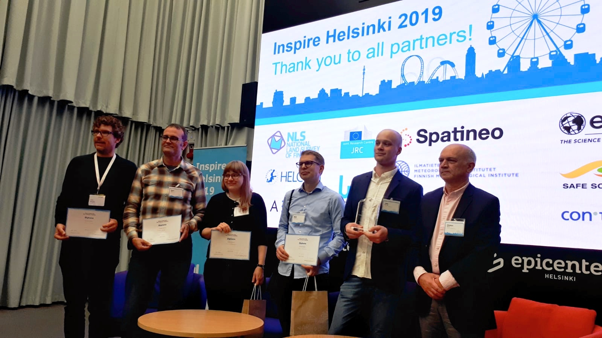

# The challenge is over, big thanks to all participants!

Winner teams of Inspire Helsinki 2019 Data challenges:

* 1st place: **Team Minerva Intelligence**: [A Landslide Application In Veneto, Italy](https://map.italy.minervageohazards.com) for challenge [Let's make most out of INSPIRE](./mostOutOfINSPIRE.html)
* 2nd place: **Team West Coast Surfers**: [Flood Warning Assistant](https://safe-inspire.s3.eu-west-2.amazonaws.com/datachallenge/www/index.html) for challenge [Let's make most out of INSPIRE](./mostOutOfINSPIRE.html)
* 3rd place: **Team Statistics Finland**: [Finding the Best
Seaside Vacation Spot](https://storymaps.arcgis.com/stories/8db3937801df4a028189f01290cfad41) for challenge [Find the best seaside vacation spot](./seasideVacationSpot.html)
* FME Special Prize winner: **[Better Wet from Sweat](https://provincienh.github.io/betterwetfromsweat/)** for challenge [Commuting 2.0](./commuting20.html)
* Esri Special Prize winners: 1st Team Better Wet from Sweat, 2nd Team Statistics Finland

Full details of all the submitted works will be made available on this website soon.

Congratulations to winners and all the teams and see you in Dubrovnik 2020!
