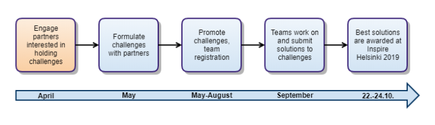

# Inspire Helsinki 2019 Data Challenge
Inspire Helsinki 2019 will host challenges for practical uses of spatial data in the domains of sea, weather and cities.

With the recent evolution of spatial data delivery technologies like WFS 3.0, vector tiles and simpler data formats for INSPIRE, the geospatial field is reaching out to a wider audience of developers to enrich applications and processes with spatial data. The challenges will not be strictly limited to INSPIRE data, they can take full advantage of all data relevant to the challenges.

Teams will produce applications, proofs of concepts, visualisations, presentations and demos by the end of September and will present the results in October in Helsinki. During the challenge month, the event organisers and challenge partners will support the teams, help provide data, tools and services to ensure successful results.

